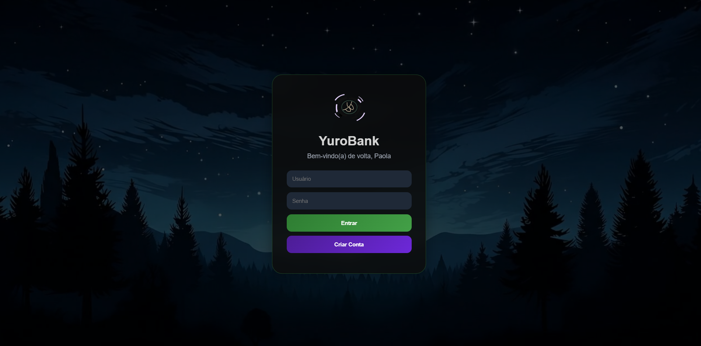
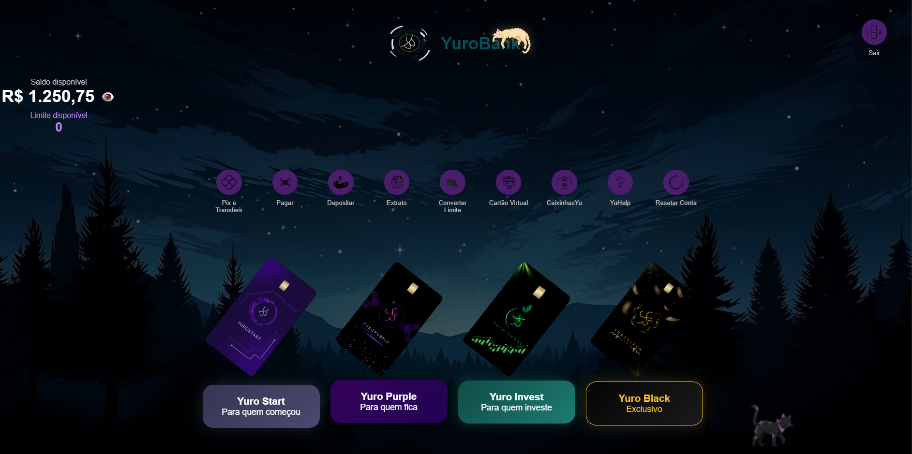
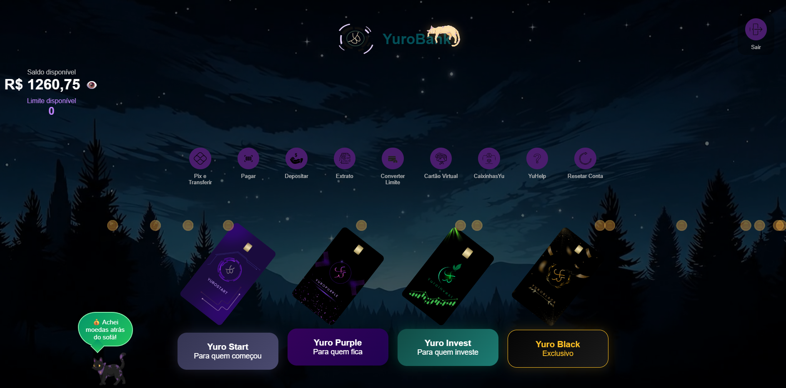
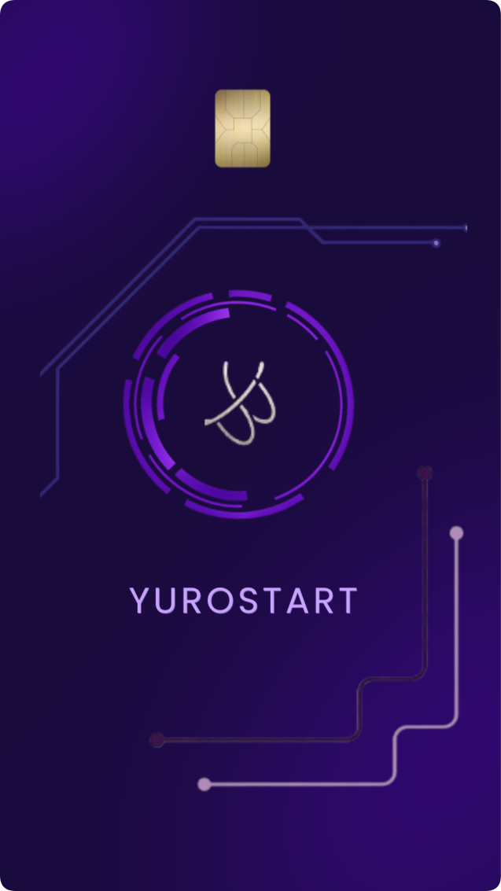
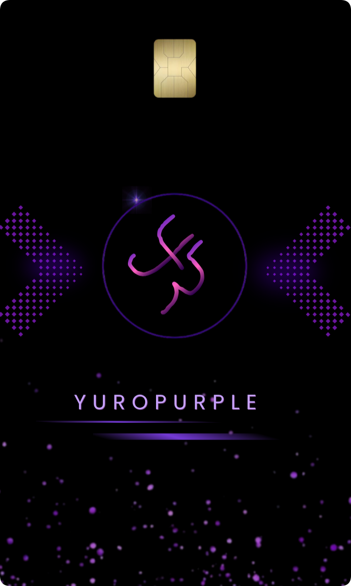
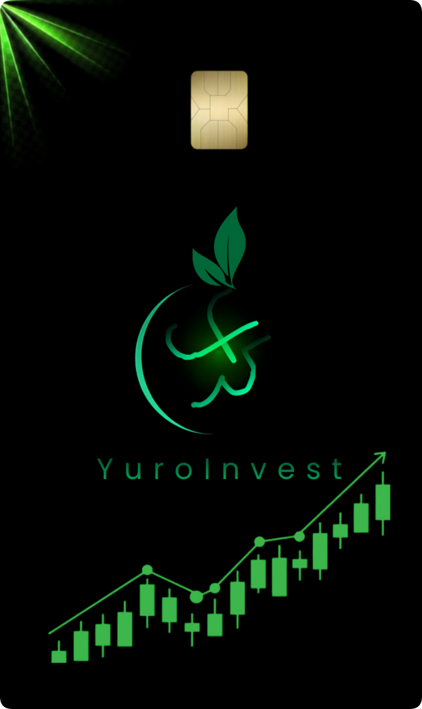
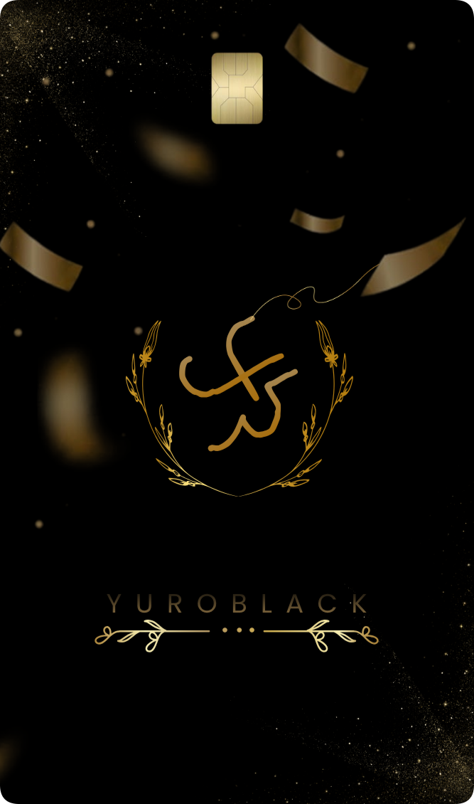

# 🏦 YuroBank

Um banco digital fictício desenvolvido para estudos de Front-end utilizando HTML, CSS e JavaScript.

O projeto foi criado com o objetivo de simular a experiência de um banco digital moderno, combinando desenvolvimento, design e experiência do usuário em uma aplicação funcional e visualmente agradável.

Além da programação, participei da criação da identidade visual do projeto utilizando Figma e Canva, desenvolvendo elementos como logotipo, cartões e componentes da interface.

---

## ✨ Funcionalidades

- 🔐 Sistema de Login
- 💰 Saldo Dinâmico
- 📄 Extrato de Movimentações
- 💸 Transferências
- 💳 Cartão Virtual
- 💾 Persistência de Dados com LocalStorage
- 📱 Interface Responsiva
- 🐱 Mascote Interativo Yuro

---

## 🖼️ Demonstração

### 🔐 Tela de Login

---

### 🏦 Interface Principal

---

### 🐱 Interações do Mascote Yuro

---

### 💳 Ecossistema de Cartões

<table align="center">
<tr>
<td align="center">
  
<b>Yuro Start</b> 
Para quem começou
</td>

<td width="60"></td>

<td align="center">
  
<b>Yuro Purple</b> 
Para quem evolui
</td>

<td width="60"></td>

<td align="center">
  
<b>Yuro Invest</b> 
Para quem investe
</td>

<td width="60"></td>

<td align="center">
  
<b>Yuro Black</b> 
Exclusivo
</td>

</tr>
</table>

---

## 🐱 Conheça o Yuro

Yuro é o mascote oficial do projeto.

Ele foi criado para trazer mais personalidade ao banco e tornar a experiência mais amigável, acompanhando o usuário durante a navegação através de animações e interações visuais.

---

## 🎨 Design e Identidade Visual

Durante o desenvolvimento do projeto também trabalhei na construção da identidade visual.

Ferramentas utilizadas:

- Figma
- Canva

Elementos criados:

- Logo do YuroBank
- Cartões digitais
- Paleta de cores
- Componentes visuais da interface

---

## 🛠️ Tecnologias

### Desenvolvimento
- HTML5
- CSS3
- JavaScript

### Ferramentas
- Git
- GitHub

### Design
- Figma
- Canva

---

## 📸 Demonstração

Em desenvolvimento.

Em breve serão adicionadas capturas de tela da aplicação e demonstrações das funcionalidades.

---

## 📊 Status do Projeto

🚧 Em desenvolvimento

Funcionalidades principais concluídas e novas melhorias sendo implementadas.

---

## 🎯 Objetivos de Aprendizado

Este projeto foi desenvolvido para praticar:

- Manipulação do DOM
- Estruturação de aplicações Front-end
- Organização de código
- Responsividade
- Armazenamento Local
- Design de Interfaces
- Experiência do Usuário (UX)

---

## 🚀 Próximas Funcionalidades

- 📦 CaixinhasYu
- 🤖 YuHelp
- 🔔 Sistema de notificações
- 📈 Melhorias de experiência do usuário

---

## 👨‍💻 Autor

Lauan Oliveira

Desenvolvedor Front-end em formação.

Atualmente estudando HTML, CSS, JavaScript, Git, GitHub e Design de Interfaces.
